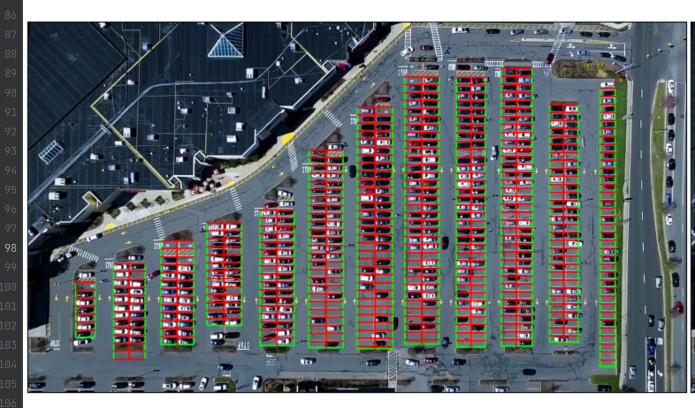
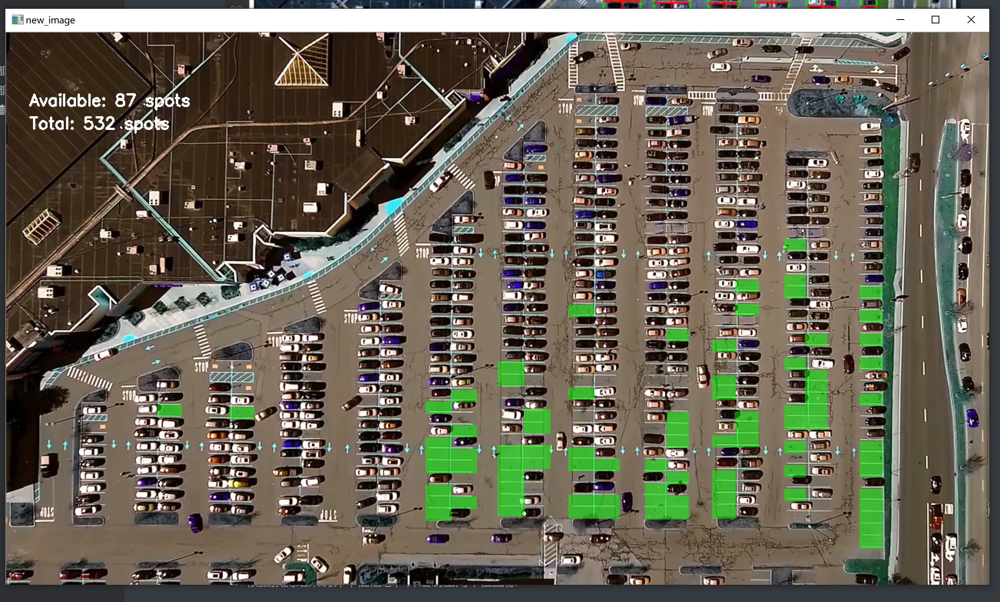

# 停车场识别

## 1. 车位划分部分

1. 对停车场图像进行识别处理，划分出车位信息并保存

2. 对停车场图像进行切割，获取每一个车位的图片，存储以供训练

## 2. 模型训练部分

使用裁剪出的图像进行训练，判断车位中是否存在车辆

模型以基于 ImageNet 训练出的 resnet18 作为基础，将全连接层输出数修改为2，使用裁切出的车位图像训练10轮，完成后存储网络模型

## 3. 车位情况查询统计部分

1. 载入车位信息文件，对输入图像进行车位划分
2. 加载网络模型，对于每个车位进行预测
3. 根据预测结果统计车位信息，并绘制空闲车位图像

